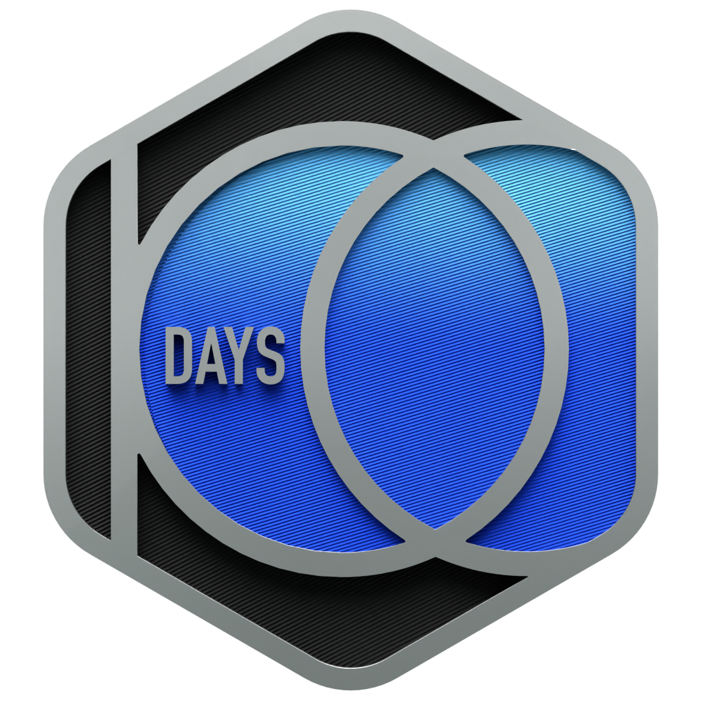
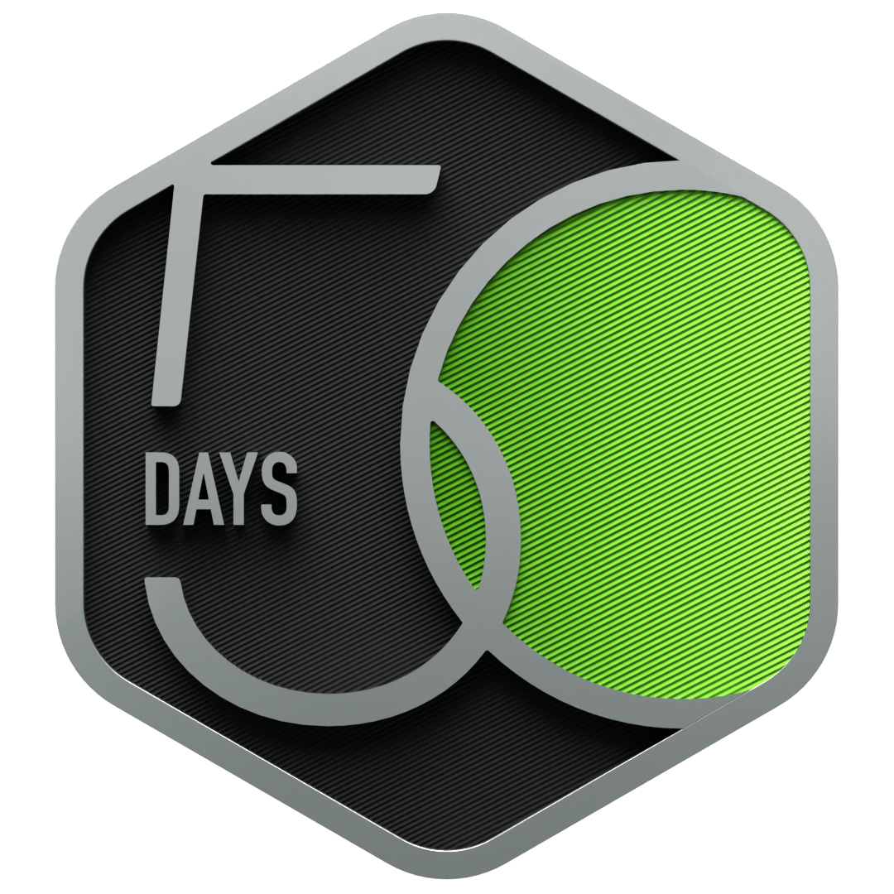

<h1 align="center">Hey there 👋, I'm Roshan Mandal</h1>

<h3 align="center">
  
</h3>

<b>🎓 B.E. Computer Science & Business Systems</b> 
<i>India</i>

## 🌐 Portfolio Website

  

---

## 🧑‍💻 About Me

- 💻 Passionate **Full Stack Developer** focused on building impactful products
- 🤖 Exploring **Generative AI, Agentic AI, and Automation**
- 🚀 Strong with **MERN Stack, Next.js, and Modern Web Technologies**
- 📚 Consistently improving **Data Structures & Algorithms**
- 🎯 Open for **Internships, Freelance Projects, and Collaborations**
- 📫 Reach me at **roshanmandal2004.7@gmail.com**

 

---

## 🏆 LeetCode

  

<h3 align="center">🏅 Achievements</h3>

  
  &nbsp;&nbsp;&nbsp;
  

  

---

## 🚀 Featured Projects

| Project | Description |
|----------|------------|
| **HireFlow** | recruitment platform featuring job management, search functionality, and seamless API-driven frontend-backend communication |
| **News Intel** | Fake news detection, summarization, and credibility scoring using AI |
| **Code Hub** | Real-time collaborative coding platform with live code editing |
| **TT-Gen** | Automated timetable generation system with scheduling optimization |

---

## 🧰 Tech Stack

---

## 📈 GitHub Stats & Activity

  

  
  

  
  

  
  

  

---

## 🎯 Current Focus

- 🤖 Building AI-powered applications
- 🚀 Developing scalable full-stack products
- 📚 Solving Data Structures & Algorithms problems
- ⚙️ Learning backend architecture and system design
- 🌱 Contributing to open-source projects

---

## 📬 Connect With Me

---

<h3 align="center">✨ Let's Build Something Great Together ✨</h3>
